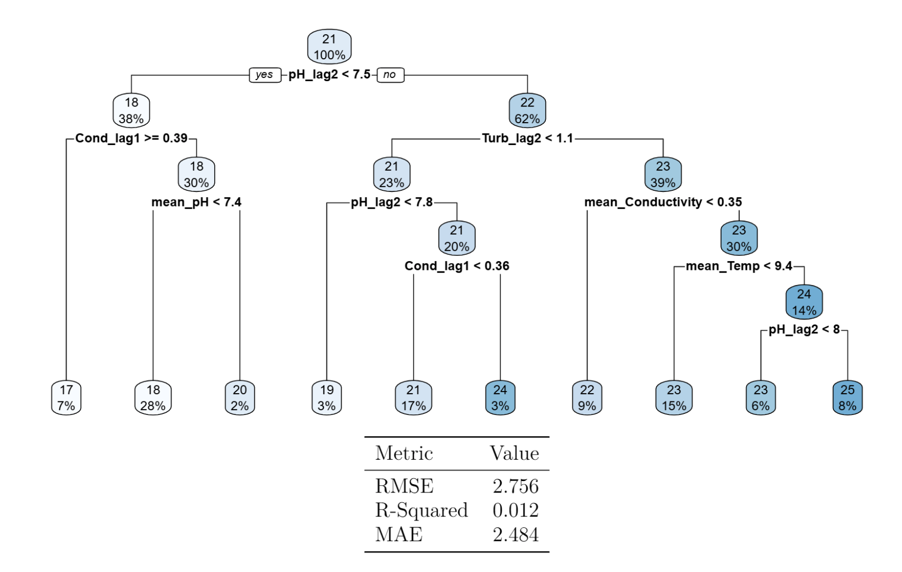
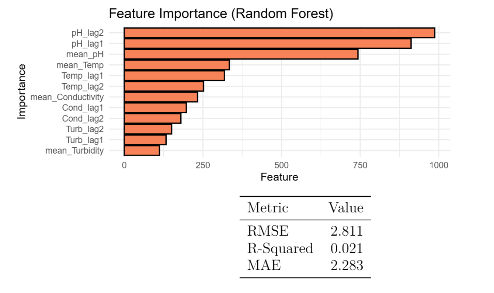

# Chemical Dosage Prediction for Water Treatment
November 2025 - December 2025    
Written in R

## Overview
This was a group project that was completed for a class final. *Only my portion of the project is included in this repository.* Real data was provided from a Colorado water treatment plant. With this time series data (roughly about 3 years worth of information) specific chemical dose amounts were predicted in order to efficiently treat the water.

The goal of the project was to optimize these dosage amounts to both maintain water quality and prevent overspending on excessive and unnecessary chemicals.

## Objective
- Determine what factors in the water indicate that a dosage change is necessary.
- Predict/classify dosage amounts based on water characteristics at a specific time.
- Assist the water treatment plant in their chemical dosage decision making process.

## Data
Since the data is provided from a Colorado water treatment plant only for the purpose of a class project, it is private. The raw data cannot be shared publicly.

Overall, there were multiple datasets that consisted of different water characteristics. These characteristics were periodically recorded and documented over time. A three year interval (2018-2020) was used due to the data being the most comprehensive during this time period.

The Ferric Chloride (FeCl) dose was predicted through four main water characteristics (pH, temperature, conductivity, and turbidity). The Cationic Polymer dose was another target variable, but due to its high correlation with the FeCl dose it was unnecessary to attempt prediction on this variable.

## The Analysis
- **Group Member Work** *(not completed by me)*
  - Data Cleaning and Preparation
    - Lagged variables were added to assist in prediction of time series data.
    - Introduced a categorical variable indicating an increase, decrease, or equal change in dosage for classification models.
    - Years 2018 and 2019 were used for training while 2020 was used for testing.
  - Models
    - Various models were attempted for both dose prediction and classification.
    - These included: linear regression, LDA, QDA, multinomial classification, and a GAM.
- **Decision Tree and Random Forest** *(completed by me)*
  - A simple decision tree was created in an attempt to model this non-linear data.
  - The R squared, RMSE, and MAE all dictate this model has poor performance.
  - Shows that pH is the primary predictor being used to predict the dosage amounts.

  - A random forest was created to try and improve model performance.
  - Similar model performance is shown by the R squared, RMSE, and MAE values even with a random forest.
  - Feature importance plot shows pH and temperature being the main predictors (as well as their lag variables).

- **Conclusion**
  - Predicting chemical dosage amounts with this data proved to be ineffective.
  - Poor data (limited dataset size, limited predictors) and the complexity of chemical dosage prediction likely attributed to poor model performance.
  - Incorporating more data and more predictors in future modeling could be beneficial.
